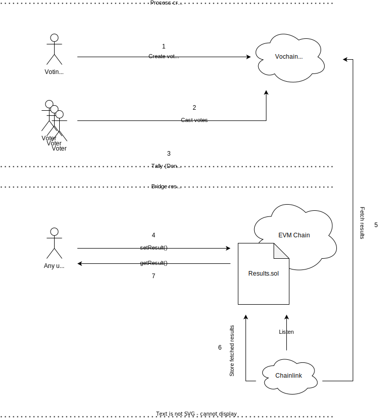
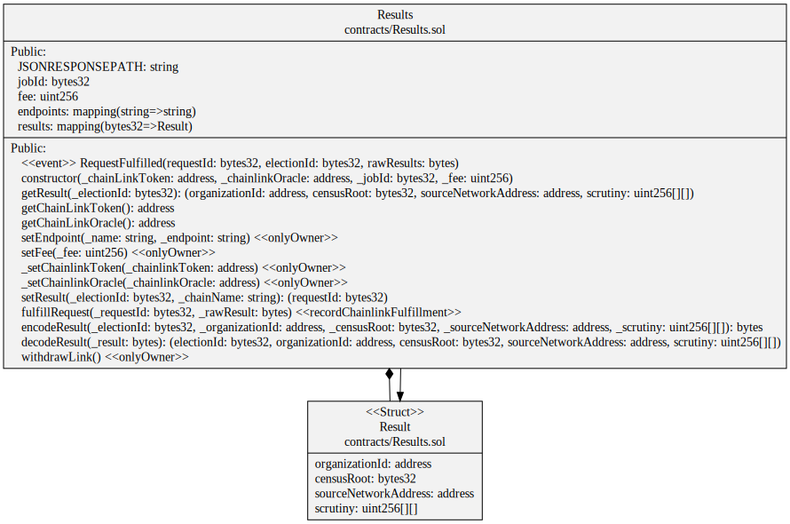

# chainlink-tally

[](code-of-conduct.md) [](https://www.gnu.org/licenses/agpl-3.0)

This repository contains all the required code for uploading L2 (Vochain) voting process results to a smartcontract on EVM based chains.

The smart contract acts as a registry for voting processes and their results.
Any user can initiate a transaction for uploading a given results by calling to the smart contract `setResult(electionID, chainName)` method. Once this function is called a Chainlink node will fetch the given process results from the given chainID using the publicy available API endpoint, thus resulting in having results information available on the EVM contract storage.

Sofware artifacts:

- Relayer: The main piece for interacting with the EVM smart contract. Connects to an EVM endpoint and is able to interact with the EVM smart contract with Golang auto-generated bindings.
- EVMClient: Is the client for connecting to a given EVM endpoint for interacting with the smart contract.
- EVMContracts: Contain all the smart contract code. Uses Hardhat as the base for development.

## Interaction flow



## Compile & Run

Compile from source in a golang environment (Go>1.19 required):

```bash
git clone https://github.com/vocdoni/chainlink-tally.git
cd chainlink-tally/relayer/evmcontracts
make all
cd ../../
go build ./cmd/main.go
./main --help
```

## Results smart contract



## Deployments

- Goerli: `0x7b74D3fd5201eefd6479970550C62D4bBA159b87`
  - Endpoints:
    - `dev` : `https://api-dev.vocdoni.net/v2/elections/`
